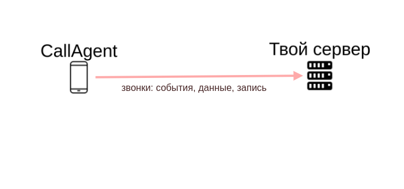

# callagent

Android-приложение для интеграции телефонии смартфона в бизнес-системы



## Приложение

### Функции

- передача событий входящего звонка: начало, ответ, завершение вызова

- передача событий исходящего звонка: начало, завершение вызова

- передача полной информации по звонку: номер звонящего/вызываемого, дата, время, длительность, направление

- передача записи звонка (только для [смартфонов со встроенной автоматической записью звонков](smartphones.md))

### Скриншоты

[перейти](screenshots.md)

### Скачать

ссылка

### Поддержка

[группа в Телеграмме](https://t.me/callagent)

## Веб-сервер (backend)

[пример веб-сервера node.js](server)

### Требования

Прием POST-запросов на url

- /event события

- /calldata данные по звонку

- /record запись звонка

- /log лог-файл со смартфона


### Формат данных

#### Событие (event)

- accountId - аккаунт смартфона

- mobile - номер смартфона

- direction - направление вызова: incoming / outgoing

- type - тип события: START / ANSWER / END

- number - номер звонящего

- uuid - id звонка, для связи событий, данных, записи

- startDate - время события

пример

`````js
{
  accountId: 'account1',
  direction: 'incoming',
  startDate: '2021-08-24 21:40:27',
  type: 'START',
  number: '+79831693504',
  uuid: 'b13b482c-7984-47d9-bb5f-fb7aa423dd57',
  mobile: '89135292966'
}

`````

#### Данные по звонку (calldata)

- accountId - аккаунт смартфона

- mobile - номер смартфона

- direction - направление вызова: incoming / outgoing

- number - номер звонящего

- uuid - id звонка

- startDate - время начала

- endDate - время завершения

- answered - признак ответа

- recordPath - файл записи на смартфоне (если есть и обнаружен)

пример

`````js
{
  accountId: 'account1',
  direction: 'incoming',
  startDate: '2021-08-24 21:40:31',
  endDate: '2021-08-24 21:40:35',
  number: '+79831693504',
  uuid: 'b13b482c-7984-47d9-bb5f-fb7aa423dd57',
  answered: true,
  mobile: '89135292966',
  recordPath: ''
}

`````
